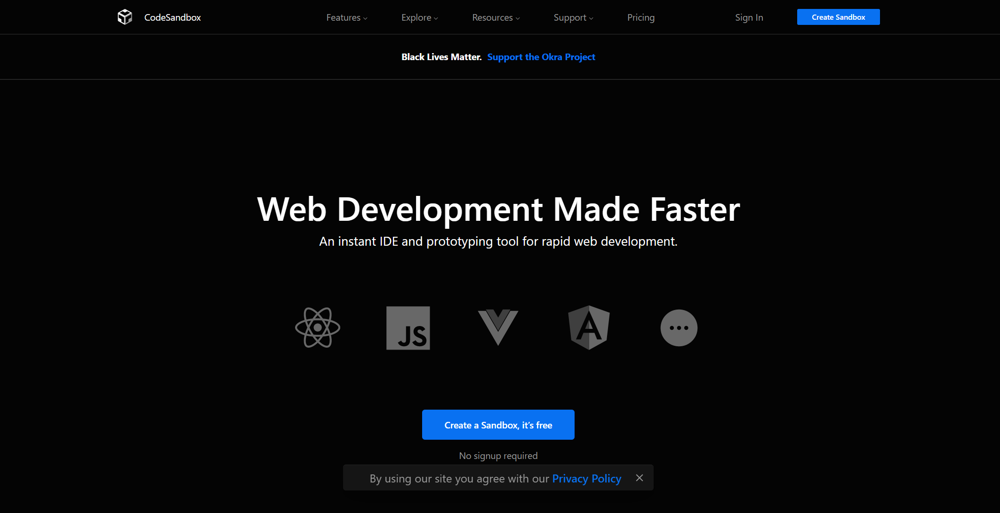
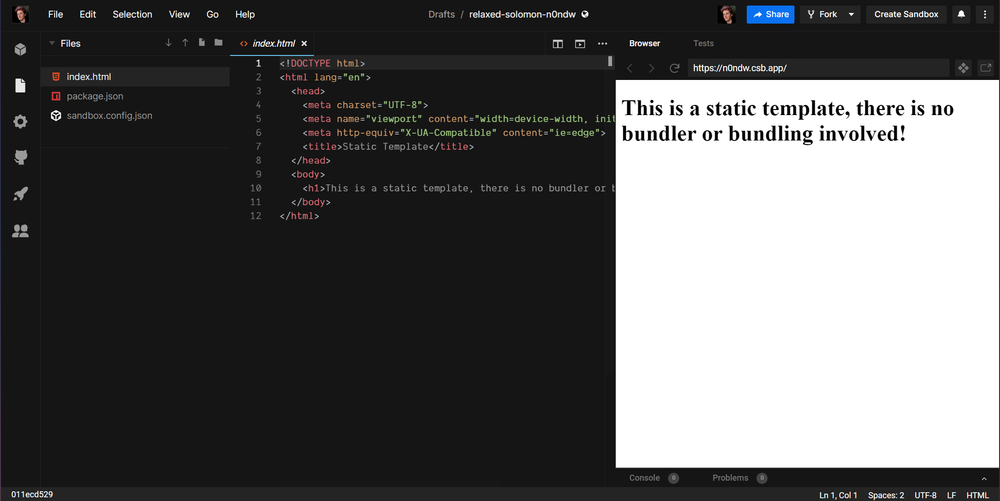
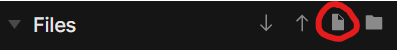
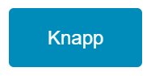
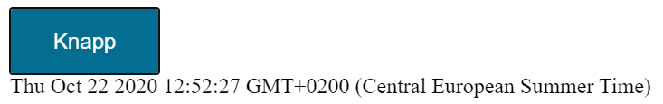
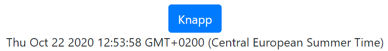

# Innføring i webutvikling

Hvis du vil begynne med en gang, hopp til [HTML](#-html).

Hvis du allerede har en grunnleggende forståelse for webutvikling, klikk deg inn på [Zero to Fullstack Hero](https://www.youtube.com/watch?v=Mj3QejzYZ70&list=PLzWjrc7MKKxyffsM7YTBnogYpBh_QUIO0).

Hvis du er helt fersk og vil ha en innføring i webutvikling, les videre.
___

Denne innføringen vil gi deg raskt innblikk i HTML, CSS og JavaScript, som er de mest brukte språkene for å utvikle nettsider.

Kort oppsumert om språkene:

- [HTML](https://www.w3schools.com/html/html_intro.asp) er det som lar oss strukturere en nettside - for eksempel fortelle nettleseren at vi vil ha en knapp
- [CSS](https://www.w3schools.com/css/css_intro.asp) lar oss utforme strukturen, så knappen kan se fancy ut
- [JavaScript](https://www.w3schools.com/js/js_intro.asp) gjør det mulig å lage funksjonalitet som ikke er bygd inn i HTML allerede, som at man eksempelvis får knappen til å vise dagens dato og nåværende tid.

I praksis er det sjeldent at man bruker HTML, CSS og JavaScript direkte på den måten vi kommer til å gjøre nå, og man bruker som regel et rammeverk som fikser HTML, CSS og JavaScript for deg. Derfor vil slutten av innføringen vise hvordan man ville implementert det vi har laget i rammeverket [React](https://reactjs.org/), som er det vi oftest bruker på [Eik Lab](https://www.facebook.com/eiklab/).

Vi kommer ikke til å gå i dybden her, men du kan få en smakebit på om nettutvikling er noe for deg. Jeg har lagt ved en [spilleliste](https://www.youtube.com/watch?v=Mj3QejzYZ70&list=PLzWjrc7MKKxyffsM7YTBnogYpBh_QUIO0) for dere som synes nettutvikling virker interessant, som vil gi dere dypere forståelse og gjøre dere rustet til å lage hva dere vil.

Ikke vær bekymret hvis ting går litt fort fram og du ikke skjønner alt, siden webutvikling krever mye trening for god forståelse. [Spillelisten](https://www.youtube.com/watch?v=Mj3QejzYZ70&list=PLzWjrc7MKKxyffsM7YTBnogYpBh_QUIO0) vil fylle inn mye som utelates her.

[Send meg en melding](https://www.facebook.com/kristian.kramas) om det er noe du lurer på underveis i innføringen eller mens du jobber deg gjennom [spillelisten](https://www.youtube.com/watch?v=Mj3QejzYZ70&list=PLzWjrc7MKKxyffsM7YTBnogYpBh_QUIO0). Jeg synes det er veldig hyggelig å hjelpe dere og ingen spørsmål er dumme når det kommer til webutvikling. Jeg kommer til å oppdatere kurset underveis basert på feedbacken deres.

## Innhold <!-- omit in toc -->

- [Innføring i webutvikling](#innføring-i-webutvikling)
  - [📄 HTML](#-html)
  - [🎨 CSS](#-css)
  - [⚙ JavaScript](#-javascript)
  - [🎉 Gratulerer!](#-gratulerer)
  - [👨‍🔬 React (Økt vanskelighetsgrad)](#-react-økt-vanskelighetsgrad)
  - [✈ Alternativer for veien videre](#-alternativer-for-veien-videre)
  - [🖋 Notater](#-notater)
  - [💌 Kontakt](#-kontakt)

## 📄 HTML

1. Gå til [CodeSandbox](https://codesandbox.io/)


2. Trykk på `Create Sandbox`
   
    

3. Velg malen som heter `static`

    

    Da får du opp en ferdig HTML-mal. Du kan programmere på venstre og se hvordan nettsiden blir seende ut på høyre.

    

    Den eneste filen vi trenger å bry oss om i dette tilfelle er `index.html`, som er hele nettsiden vår for øyeblikket. De andre filene kan du ignorere, siden de bare har med utviklermiljøet å gjøre (som er programmet du skriver i).

    I `index.html` er det mye rare greier...

    ```html
    <!DOCTYPE html>
    <html lang="en">
        <head>
            <meta charset="UTF-8" />
            <meta name="viewport" content="width=device-width, initial-scale=1.0" />
            <meta http-equiv="X-UA-Compatible" content="ie=edge" />
            <title>Static Template</title>
        </head>
        <body>
            <h1>
                This is a static template, there is no bundler or bundling involved!
            </h1>
        </body>
    </html>
    ```

    ...men det meste kan ignoreres, siden nesten alt er informasjon til nettleseren, som vi ikke trenger å tenke på nå.

    Det vi vil fokusere på er det som er inne i body-knaggen:

     ```html
    <body>
        <h1>
            This is a static template, there is no bundler or bundling involved!
        </h1>
    </body>
    ```

    Du kan tenke på en tag som en boks man putter ting i. `<body></body>` er boksen du ser på høyre side, og det vi setter mellom åpningsknaggen `<body>` og lukkeknaggen `</body>` vil vises på nettsiden.

4. Erstatt overskriften:

    ```html
    <h1>
        This is a static template, there is no bundler or bundling involved!
    </h1>
    ```

    med

    ```html
    <button>Knapp</button>
    ```

    Og vi har laget en enkel HTML-side med én ✨ <button>Knapp</button> ✨:

## 🎨 CSS

For å utforme knappen bruker vi CSS. 

1. Lag en ny fil ved å trykke på `New File`-ikonet eller `File -> New File` i verktøylinja

    


2. Gi den navnet `styles.css`
3. Legg til `<link rel="stylesheet" href="styles.css">` i head-knaggen i `index.html` for å importere stilene i HTML-filen:

     ```html
    <!DOCTYPE html>
    <html lang="en">
        <head>
            <meta charset="UTF-8" />
            <meta name="viewport" content="width=device-width, initial-scale=1.0" />
            <meta http-equiv="X-UA-Compatible" content="ie=edge" />
            <title>Static Template</title>
            <link rel="stylesheet" href="styles.css">
        </head>
        <body>
            <button>Knapp</button>
        </body>
    </html>
    ```

4. Legg til en klasse med navn `btn` i `styles.css`:

     ```css
    .btn {

    }
    ```

5. Legg til klassen i knappen i `index.html`, ved å legge til `class="btn"` i åpningsknaggen til knappen:

    ```html
    <!DOCTYPE html>
    <html lang="en">
        <head>
            <meta charset="UTF-8" />
            <meta name="viewport" content="width=device-width, initial-scale=1.0" />
            <meta http-equiv="X-UA-Compatible" content="ie=edge" />
            <title>Static Template</title>
            <link rel="stylesheet" href="styles.css" />
            <script src="btn.js"></script>
        </head>
        <body>
            <button class="btn">Knapp</button>
        </body>
    </html>
    ```

6. Legg til litt utforming i klassen:

     ```css
    .btn {
        border: none; /* Fjerner sort ramme rundt standardknapp */
        color: white; /* Endrer farge på tekst til hvit */
        padding: 15px 32px; /* Legger til mer pusterom rundt teksten i knappen */
        text-align: center;  /* Plasserer teksten i midten av knappen */
        text-decoration: none; /* Fjerner at standardstil på tekst */
        font-size: 16px; /* Endrer tekststørrelse */
        background-color: #008cba; /* Endrer bakgrunnsfarge til blå */
        border-radius: 4px; /* Avrunder hjørnene */
    }
    ```

    Dette er utforming inspirert av w3schools eksempler - linken er i notatene. Prøv deg gjerne fram ved å endre på verdiene, og se hva som skjer.

    Husk å lagre (<kbd>CTRL</kbd> + <kbd>S</kbd> eller <kbd>⌘</kbd> + <kbd>S</kbd>) for å se endringene du gjør.

    

7. Vi kan legge til enkel scripting for stiler uten JavaScript for tilfeller som når musepekeren er over et objekt. Jeg lagde dette basert på w3schools eksempler for å gjøre knappen litt mer livlig:

     ```css
    .btn {
        border: none; /* Fjerner sort ramme rundt standardknapp */
        color: white; /* Endrer farge på tekst til hvit */
        padding: 15px 32px; /* Legger til mer pusterom runt teksten i knappen */
        text-align: center;  /* Plasserer teksten i midten av knappen */
        text-decoration: none; /* Fjerner at standardstil på tekst */
        font-size: 16px; /* Endrer tekststørrelse */
        background-color: #008cba; /* Endrer bakgrunnsfarge til blå */
        border-radius: 4px; /* Avrunder hjørnene */
        transition-duration: 0.4s; /* Animerer overganger, så de blir mykere */
    }

    .btn:hover { /* Aktiveres bare når musepeker er over knapp */
        background-color: #046788; /* Gjør farge mørkere */
    }
    ```

_Du lurer kanskje på hvorfor vi ikke lager alle stilene fra bunnen av på egenhånd? Det er fordi man som oftest henter løsninger fra andre for å spare tid og for å være sikre på at løsningen er utprøvd og oppfører seg som forventet på alle plattformer. Ulike kombinasjoner av nettlesere og operativsystemer har litt ulike måter å tyde CSS, og det er større sjanse for at ting fungerer universalt med en ferdig løsning._

_For dere som vil lage ting fra bunnen av, kommer det mer om det i [spillelisten](https://www.youtube.com/watch?v=Mj3QejzYZ70&list=PLzWjrc7MKKxyffsM7YTBnogYpBh_QUIO0)._

## ⚙ JavaScript

Vi har nå en veldig fin knapp...

...som ikke gjør noe.

For å gi den funksjonalitet bruker vi JavaScript.

1. Lag en ny fil ved å trykke på `New File`-ikonet eller `File -> New File` i verktøylinja
2. Gi den navnet `button.js`
3. Legg til `<script src="button.js"></script>` i head-knaggen i `index.html` for å importere scriptet i HTML-filen:

     ```html
    <!DOCTYPE html>
    <html lang="en">
        <head>
            <meta charset="UTF-8" />
            <meta name="viewport" content="width=device-width, initial-scale=1.0" />
            <meta http-equiv="X-UA-Compatible" content="ie=edge" />
            <title>Static Template</title>
            <link rel="stylesheet" href="styles.css">
            <script src="button.js"></script>
        </head>
        <body>
            <button class="btn">Knapp</button>
        </body>
    </html>
    ```

4. Vi lager en funksjon i `button.js` som setter inn nåtid i en gitt knagg:

    ```js
    function getDate(id) {
        document.getElementById(id).innerHTML = Date();
    }
    ```

    - `document` refererer til nettsiden
    - `getElementById` henter et dokument med ID-en vi mater den
    - `innerHTML` refererer til det som er mellom åpnings- og lukkeknaggen
    - `Date()` gir oss nåtid

    Det vil si at når funksjonen aktiveres, vil knaggen vi har valgt fylles med dagens dato, som vises på nettsiden.

5. Legg til en knagg med ID som kan vise datoen i `index.html`:

    ```html
    <!DOCTYPE html>
    <html lang="en">
        <head>
            <meta charset="UTF-8" />
            <meta name="viewport" content="width=device-width, initial-scale=1.0" />
            <meta http-equiv="X-UA-Compatible" content="ie=edge" />
            <title>Static Template</title>
            <link rel="stylesheet" href="styles.css" />
            <script src="button.js"></script>
        </head>
        <body>
            <button class="btn">
                Knapp
            </button>
            <div id="date"></div>
        </body>
    </html>
    ```

6. Vi ber knappen kjøre funksjonen `getData()` når den trykkes, ved å legge til `onclick="getDate('date')"` i åpningsknaggen:

    ```html
    <!DOCTYPE html>
    <html lang="en">
        <head>
            <meta charset="UTF-8" />
            <meta name="viewport" content="width=device-width, initial-scale=1.0" />
            <meta http-equiv="X-UA-Compatible" content="ie=edge" />
            <title>Static Template</title>
            <link rel="stylesheet" href="styles.css" />
            <script src="button.js"></script>
        </head>
        <body>
            <button class="btn" onclick="getDate('date')">
                Knapp
            </button>
            <div id="date"></div>
        </body>
    </html>
    ```

    Sørg for at ID-en til knaggen som skal vise dato og argumentet til `getDate()` er like. Jeg har valgt å bruke "date".

7. Trykk på knappen.

    


## 🎉 Gratulerer!

Nå har du laget en knapp med HTML, CSS og JavaScript.

Videre kan du velge om du har lyst til å:

1. Gjøre det samme i et skikkelig rammeverk (React), ved å fortsette denne innføringen
2. Hoppe rett inn i [Zero to Fullstack Hero](https://www.youtube.com/watch?v=Mj3QejzYZ70&list=PLzWjrc7MKKxyffsM7YTBnogYpBh_QUIO0) og lære deg fullstack-utvikling
3. [Sende meg en melding](https://www.facebook.com/kristian.kramas), dersom du har en idé om noe du vil lage, så hjelper jeg deg i gang
4. Gjøre noe helt annet, hvis dette ikke var helt din greie

## 👨‍🔬 React (Økt vanskelighetsgrad)

Her fokuserer jeg på å implementere det samme i React og vil ikke forklare hvordan alt fungerer, siden hensikten er at du bare får en liten smakebit på React før du fortsetter. Husk å lagre for å se endringer.

1. Gå til denne [React-malen](https://codesandbox.io/s/react-bootstrap-5rui9?file=/src/App.jsx)
2. Pass på at du er i filen `App.jsx`:

    ```jsx
    import React, { useState } from "react";
    import "styles/styles.css";
    import "styles/bootstrap.scss";

    export default () => {
        return (
            <div className="text-center">
                <div className="">Hello World!</div>
            </div>
        );
    };
    ```

3. Importer en ferdiglagd knapp fra biblioteket React Bootstrap og Bytt ut `<div className="">Hello World!</div>` med `<Button>Knapp</Button>`:

    ```jsx
    import React from "react";
    import "styles/styles.css";
    import "styles/bootstrap.scss";
    import Button from "react-bootstrap"

    export default () => {
        return (
            <div className="text-center">
                <Button>Knapp</Button>
            </div>
        );
    };
    ```

4. Legg til en knagg der vi kan plassere datoen:

    - Importer `useState`, så vi kan lagre og endre dato
    - Lag en *state* for dato med `const [date, setDate] = useState();`
    - Legg til `<div>{date}</div>` under knappen

    Du vil lære mer om hva en *state* er og hvorfor vi bruker det i [spillelisten](https://www.youtube.com/watch?v=Mj3QejzYZ70&list=PLzWjrc7MKKxyffsM7YTBnogYpBh_QUIO0).

    ```jsx
    import React, { useState } from "react";
    import "styles/styles.css";
    import "styles/bootstrap.scss";
    import Button from "react-bootstrap"

    export default () => {
        const [date, setDate] = useState();

        return (
            <div className="text-center">
                <Button>Knapp</Button>
                <div>{date}</div>
            </div>
        );
    };
    ```

5. Gjør så knappetrykk endrer dato til nåtid, ved å legge til `onClick={() => setDate(Date())` i åpningsknaggen til knappen:

    ```jsx
    import React, { useState } from "react";
    import "styles/styles.css";
    import "styles/bootstrap.scss";
    import Button from "react-bootstrap"

    export default () => {
        const [date, setDate] = useState();

        return (
            <div className="text-center">
                <Button onClick={() => setDate(Date())}>Knapp</Button>
                <div>{date}</div>
            </div>
        );
    };
    ```

6. Trykk på knappen.
7. 👏👏👏

    

## ✈ Alternativer for veien videre

1. Se [Zero to Fullstack Hero](https://www.youtube.com/watch?v=Mj3QejzYZ70&list=PLzWjrc7MKKxyffsM7YTBnogYpBh_QUIO0) og lære deg fullstack-utvikling
2. [Sende meg en melding](https://www.facebook.com/kristian.kramas), dersom du har en idé om noe du vil lage, så hjelper jeg deg i gang

## 🖋 Notater
- [CodeSandbox](https://codesandbox.io/)
- [Ferdig prosjekt (HTML, CSS og JavaScript)](https://codesandbox.io/s/knapp-med-html-css-javascript-z6kc6)
- [React-mal](https://codesandbox.io/s/react-bootstrap-5rui9?file=/src/App.jsx)
- [Ferdig prosjekt (React)](https://codesandbox.io/s/knapp-med-react-g0w3p?file=/src/App.jsx)
- [Spilleliste: Zero to Fullstack Hero](https://www.youtube.com/watch?v=Mj3QejzYZ70&list=PLzWjrc7MKKxyffsM7YTBnogYpBh_QUIO0)
- [CSS-eksempler for knapper](https://www.w3schools.com/css/css3_buttons.asp)
  
## 💌 Kontakt

| Kanal    | Info                                     |
|----------|------------------------------------------|
| Facebook | https://www.facebook.com/kristian.kramas |
| Mobil    | 95157097                                 |
| E-post   | kristiankramas@outlook.com               |